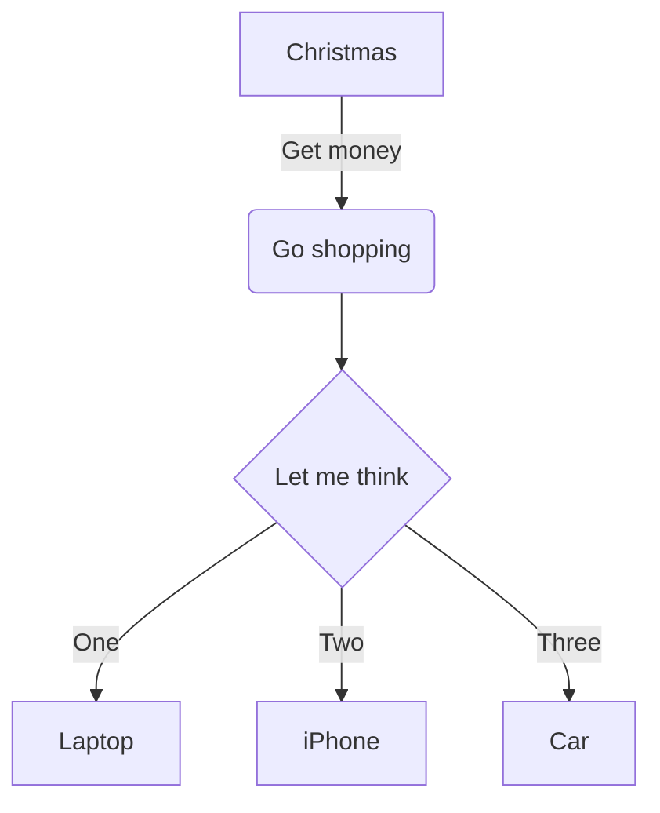
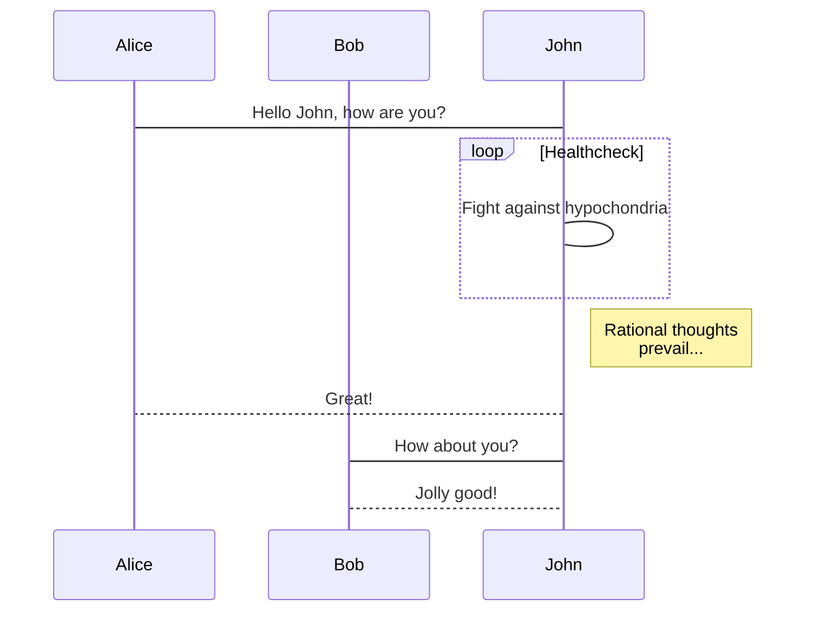

The first article which is posted by BiSheng.

---

# Hello world!

## trying mermaid in `pre` block

```mermaid
graph TD
A[Christmas] -->|Get money| B(Go shopping)
B --> C{Let me think}
C -->|One| D[Laptop]
C -->|Two| E[iPhone]
C -->|Three| F[Car]
```

## trying react component plugin

```mermaid
graph TD;
    A-->B;
    A-->C;
    B-->D;
    C-->D;
```

## subsequece

```mermaid
sequenceDiagram
    participant Alice
    participant Bob
    Alice->John: Hello John, how are you?
    loop Healthcheck
        John->John: Fight against hypochondria
    end
    Note right of John: Rational thoughts <br/>prevail...
    John-->Alice: Great!
    John->Bob: How about you?
    Bob-->John: Jolly good!
```
