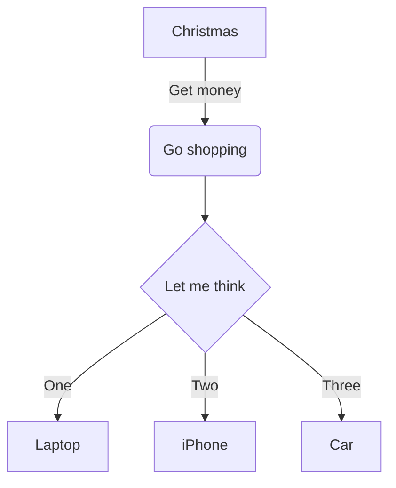

# bisheng-plugin-mermaid

This is a Bisheng plugin to generate Mermaid diagrams.

## Install

Install with `npm`:

```bash
npm install --save bisheng-plugin-mermaid
```

or with `yarn`

```bash
yarn add bisheng-plugin-mermaid
```

## Usage

In markdown:

<pre>

</pre>

would be rendered as


## License

MIT
